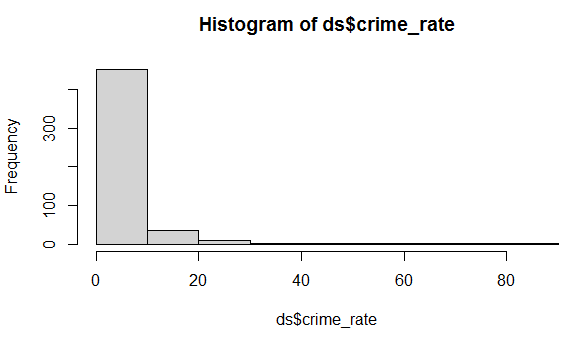
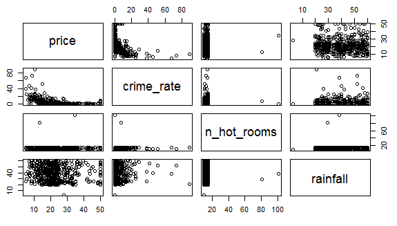

# Data-Analysis-in-R

This is a comparision program which is written for learning various methods to build a machine learning model. This can be used in Business Data Analysis and in various prediction models in oeder to make them efficient and presentable.

Goal is to provide a contrast in different models based on the parameters like accuracy, confusion matrix and MSE.

## 🔨 Basic Working 

We took two datasets, i.e, House Price and Movie Collection and on these datasets we applied techniques such as LDA, Logistic Regression, Support Vector Machine and Decision Tree. 

1. In House Price Analysis, we have to classify the model such that it presents a view, whether the house listed will be sold in next 3 months or not. For this we employed Linear Discriminant Analysis and Logistic Regression, after which the MSE for both is calculated to examine the best model.

2. Movie Collection, is separated in two parts. The first one tells about the collection a perticular movie made at Box Office and the other part tells that whether the movie won oscar or not. Here SVM is used for modelling and Decision Tree for both classification and regression model is made to enhance the presentation of the model. 


### Test, Train and Validation
 Split data into train, validation and test dataset.These datasets help us find the best model and prevent overfitting.
 For each hyperparameter combination, train a model with the training dataset, and evaluate the trained model with the validation dataset to provide an unbiased evaluation. Select the best model based on the validation metrics. The test data is used to provide an unbiased evaluation of the final model.
 


## Dependencies

- Python 3.6
- RStudio
- NumPy
- Scikit-learn

## 📦 Install

Open the code ```Analysis_LDA.R``` in Rstudio after downloading both RStudio and RStudio for windows simply run it. Before this save the csv files in a folder so that you can fetch it by putting the location of saved file in the code.

Similarly fetch the files for SVM and Decision Tree model and run the code line by line by pressing ```Ctrl+Enter```.
